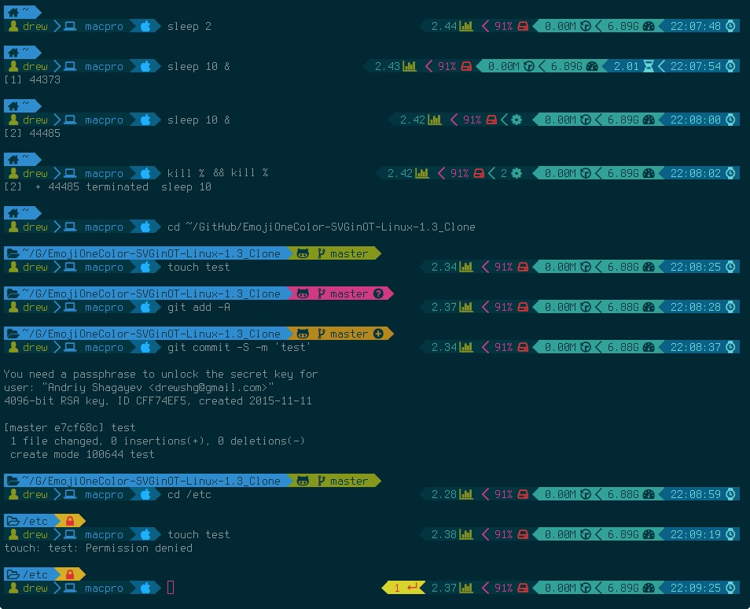
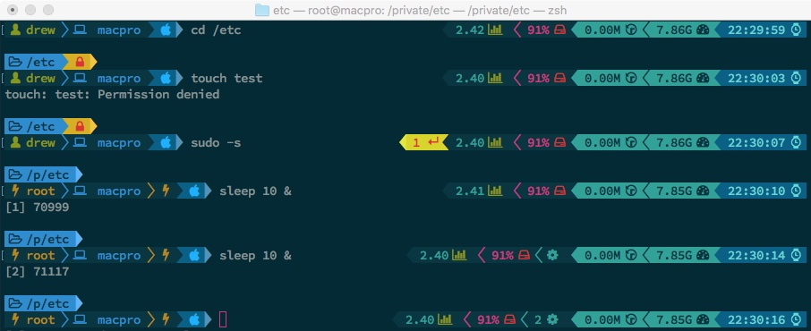

# Ansible role: macterm

[![MIT licensed][mit-badge]][mit-link]
[![Galaxy Role][role-badge]][galaxy-link]

Ansible role for terminal configuration on MacOS (Linux coming soon)

This role does the following:

 - Installs [Nerdfonts][nerdfonts]
 - Installs [Terminus Powerline][terminus-git] font if configured (see Role Variables section)
 - Imports Terminal.app Profile with Custom [Solarized Dark Colorscheme][solarized-link]
 - Installs [Homebrew][homebrew] if needed - see Role Variables section
 - Installs iTerm2 from homebrew
 - Imports iTerm2 profile with Custom Solarized Dark Colorscheme
 - Sets up nerdfonts for Non-ASCII Fonts and Terminus-Powerline font as ASCII Font.

In combination with [ansible-ohmyzsh role](https://github.com/drew1kun/ansible-ohmyzsh) getting the following results:

iTerm2:


MacOS Terminal app:



Requirements
----

NOTE: Role requires Fact Gathering by ansible!

One of the following OS (or deriviatives):
  - MacOS (with [Homebrew][homebrew])

If Homebrew is not installed on the managed host, install the following role via galaxy:

```
ansible-galaxy install drew1kun.homebrew
```

And include it in the playbook:

```
roles:
- drew1kun.homebrew
```

Role Variables
----
| Variable | Description | Default |
|----------|-------------|---------|
| `mac_terminal_iterm2` | install iterm2. If yes - homebrew and terminus_powerline roles will be fetched as dependencies | `yes` |
| `mac_terminal_colorscheme` | Terminal app default theme (for iter2 change it manually in Preferences). OPTIONS: `Solarized_Dark_Custom` or `Nord_Custom` | `Nord_Custom` |

Dependencies
----

 - [drew1kun.terminus_powerline][terminus_powerline-galaxy-link] (conditionally, when: terminal_iterm2 and terminal_homebrew_dep both set to 'yes')
 - [drew1kun.nerdfonts][nerdfonts-galaxy-link]

Install via ansible-galaxy:

```
ansible-galaxy install drew1kun.nerdfonts drew1kun.terminus_powerline
```

Example Playbook
----

```yaml
- hosts: dev_clients
  gather_facts: yes
  roles:
  - role: drew1kun.macterm
```

License
----

[MIT][mit-link]

Author Information
----

Andrew Shagayev | [e-mail](mailto:drewshg@gmail.com)

[role-badge]: https://img.shields.io/badge/role-drew1kun.macos__terminal-green.svg
[galaxy-link]: https://galaxy.ansible.com/drew1kun/macterm/
[homebrew-galaxy-link]: https://galaxy.ansible.com/drew1kun/homebrew/
[nerdfonts-galaxy-link]: https://galaxy.ansible.com/drew1kun/nerdfonts/
[terminus_powerline-galaxy-link]: https://galaxy.ansible.com/drew1kun/terminus_powerline/
[mit-badge]: https://img.shields.io/badge/license-MIT-blue.svg
[mit-link]: https://raw.githubusercontent.com/drew1kun/ansible-terminal/master/LICENSE
[homebrew]: http://brew.sh/
[nerdfonts]: https://nerdfonts.com/
[terminus-git]: https://github.com/drew1kun/terminus_powerline_font_osx
[solarized-link]: http://ethanschoonover.com/solarized
